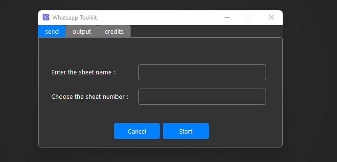

## Python Whatsappkit 💡

### What does this script do ? 🧰
automating sending messages for many people to their numbers from whatsapp web that are been extracted from excel sheet.

### Setup (Required to Run) 🔩 ⚙️
- pip install pipenv

### Prepare ✍🏼
- pipenv install --ignore-pipfile
- add excelsheet to data folder
- pipenv run python main.py

### PS 🗒
Make sure that you are connected to a stable internet and you will use it the best way

### Contributors 👏
